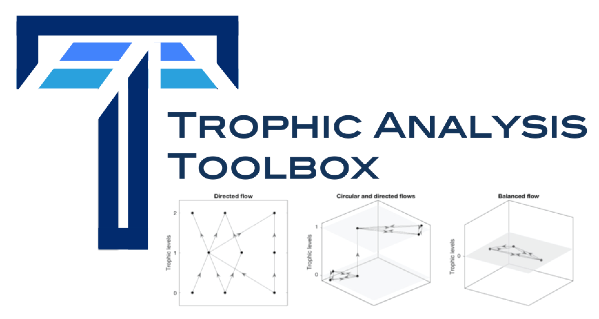

# The Trophic Analysis Toolbox

The Trophic Analysis Toolbox is an easy to use open [*Matlab*](https://github.com/BazilSansom/How-directed-is-a-directed-network/tree/master/Matlab_files) and [*Python*](https://github.com/BazilSansom/How-directed-is-a-directed-network/tree/master/Python_files) toolbox that implements methods for the analysis and visualisation of flow structure in directed networks including trophic levels and coherence (1, 2), as well as other related methods and performs a wide variety of operations on directed graphs.

At this stage we are still in the process of migrating the toolbox to this repository which we will continue to expand and update
over time.

This toolbox was written by:
- Bazil Sansom (University of Warwick)
- Samuel Johnson (University of Birmingham)
- Jose Moran (CAMS/EHESS)

## Papers

[1] Macaky, Johnson and Sansom (2020) How directed is a directed network? ([Paper available here](https://www.rebuildingmacroeconomics.ac.uk/how-directed-is-a-directed-network)).

[2] Johnson et al. (2014) Trophic coherence determines food-web stability  ([Paper available here](https://www.pnas.org/content/111/50/17923)).
